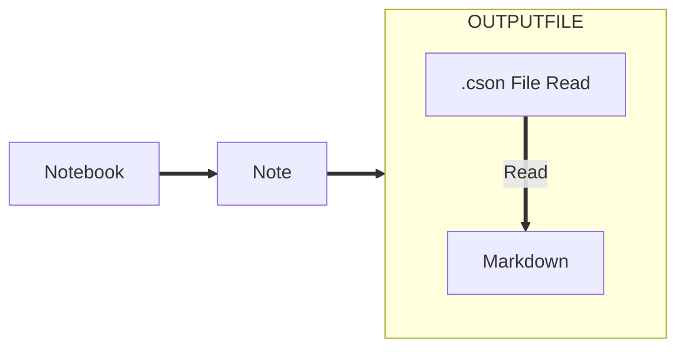

BoostNote_Express_Program Story
===
# Background
***
What made me take this project?
when i want to publish an blog, I have to export the md files.
When i want to open my note in another app, I have to export the md files.
An I have to choose the folder that the file export to, In a explore windows. And i think it is not user-friendly.
I used to want to change a Note app in the past. But this app is the best note app i have use.
So MAY BE I can start a project, and maybe I can solve this problem.

# Design
***


# Problems Encountered
***
## How to List all the File
### Linux Platform
Code:
```cpp
#ifdef __linux__
#include <dirent.h>
#include <string>
#include <sys/stat.h>
#include <unistd.h>
void getFiles(const char* cate_dir, std::vector<std::string>& output)
{
    DIR* dir;
    struct dirent* ptr;
    char base[1000];

    if ((dir = opendir(cate_dir)) == NULL) {
        perror("Open dir error...");
        exit(1);
    }

    while ((ptr = readdir(dir)) != NULL) {
        if (strcmp(ptr->d_name, ".") == 0 || strcmp(ptr->d_name, "..") == 0) ///current dir OR parrent dir
            continue;
        else if (ptr->d_type == 8) ///file
            //printf("d_name:%s/%s\n",basePath,ptr->d_name);
            output.push_back(ptr->d_name);
        else if (ptr->d_type == 10) ///link file
            //printf("d_name:%s/%s\n",basePath,ptr->d_name);
            continue;
        else if (ptr->d_type == 4) ///dir
        {
            output.push_back(ptr->d_name);
            /*
		        memset(base,'\0',sizeof(base));
		        strcpy(base,basePath);
		        strcat(base,"/");
		        strcat(base,ptr->d_nSame);
		        readFileList(base);
			*/
        }
    }
    closedir(dir);
}
#endif
```

### Windows Platform
Code:
```cpp
#ifdef _WIN32
#include <direct.h>
#include <io.h>
#define ACCESS _access
#define MKDIR(a) _mkdir((a))
#define MAX_PATH (260)
void getFiles(const char* cate_dir, std::vector<std::string>& output)
{
    long hFile = 0;
    // 文件信息
    struct _finddata_t fileinfo;
    std::string p;
    if ((hFile = _findfirst(p.assign(cate_dir).append("\\*").c_str(), &fileinfo)) != -1) {
        do {
            // 保存文件的全路径
            std::string pathr = p.assign(cate_dir).append("\\").append(fileinfo.name);
            pathr = pathr.substr(9, pathr.size() - 9);
            // std::cout << pathr << std::endl;
            if (pathr != "." && pathr != "..")
                output.push_back(pathr);

        } while (_findnext(hFile, &fileinfo) == 0); //寻找下一个，成功返回0，否则-1
        _findclose(hFile);
    }
}
```
# Continous